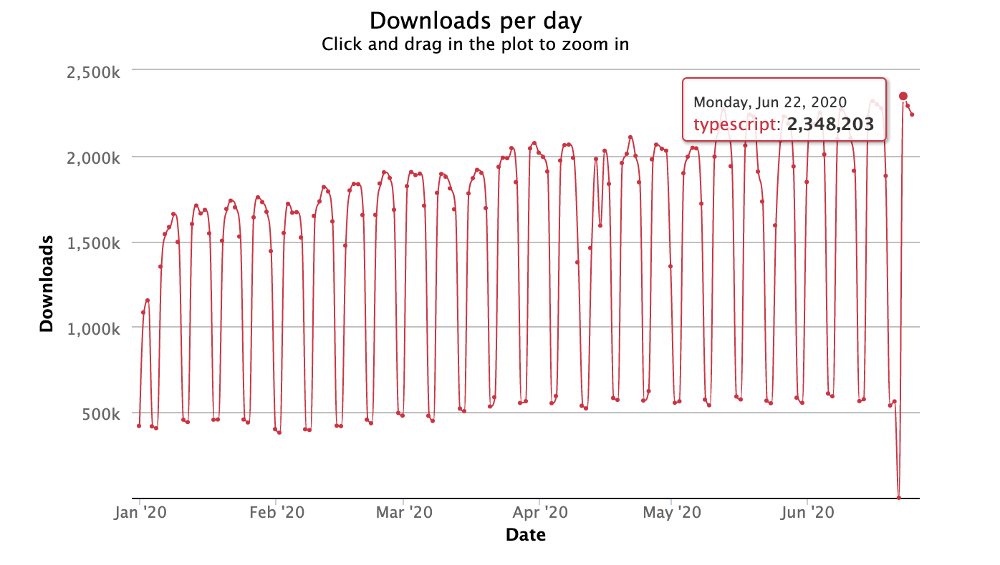

## 定义

[TypeScript](https://www.typescriptlang.org/) 是一种由微软开发的自由和开源的编程语言。它是 `JavaScript` 的一个超集, 包含了 `JavaScript` 的所有元素, 可以载入 `JavaScript` 代码运行, 并扩展了 `JavaScript` 的语法,  而且本质上向这个语言添加了可选的静态类型和基于类的面向对象编程。它可以编译成纯 `JavaScript` 。编译出来的 `JavaScript` 可以运行在任何浏览器上。`TypeScript `编译工具可以运行在任何服务器和任何系统上。 [TypeScript Github](https://github.com/Microsoft/TypeScript)

## Typescript 与 JavaScript 的区别

|  Typescript  |  Javascript  |
|---------|---------|
|静态语言|动态语言|
|一种面向对象的编程语言, 需要TypeScript编译器才能转换为JavaScript文件|一种脚本语言, 不需要编译器, 可以在浏览器上运行。|

## 为什么使用TypeScript

`TypeScript` 有两个主要目标:

- 提供 `JavaScript` 的可选类型系统。

- 提供从将来的 `JavaScript` 版本到当前 `JavaScript` 引擎的计划功能



[npm 下载量](https://npm-stat.com/charts.html?package=typescript&from=2015-01-01)

### 为什么要向 JavaScript 添加类型

类型具有 **提高代码质量** 和 **可理解性** 的能力。大型团队（`Google`, `Microsoft`, `Facebook`）一直在得出这一结论。 特别:

- 类型在进行重构时可以提高敏捷性。 对于编译器来说, 捕获错误比使事情在运行时失败更好。
- 类型是您可以拥有的最佳文档形式之一。 函数签名是一个定理, 函数体是证明。

但是, 类型定义有时候不需要特别的正式。 `TypeScript` 会根据类型推导尽可能降低的我们定义类型的成本。

## 如何使用

### 安装

```sh
npm install -g typescript
```

### 新建文件
```sh
echo hello_world.ts > const gender: string = 'Female';
```

### 编译
```sh
tsc hello_world.ts
```

## 直接尝试

[TypeScript Playground](https://www.typescriptlang.org/play/index.html)

<iframe
  width='105%'
  height='500'
  src='https://www.typescriptlang.org/play/index.html'>
</iframe>

## 学习资料

[《TypeScript Deep Dive》](https://basarat.gitbook.io/typescript/) 是一本很好的开源书，从基础到深入，很全面的阐述了 `TypeScript` 的各种魔法，不管你是新手，还是老鸟，它都将适应你。此外，它不同于 `TypeScript` 官方给出的文档（当然 `TypeScript` 给出的文档是很好的），在此书中，结合实际应用下的场景用例，你将能更深入的理解 `TypeScript`。[中文版](https://jkchao.github.io/typescript-book-chinese/)

## 参考资料

[TypeScript](https://www.typescriptlang.org/)

[Why Typescript](https://basarat.gitbook.io/typescript/getting-started/why-typescript)

[TypeScript 入门教程](https://juejin.im/post/5edd8ad8f265da76fc45362c)
